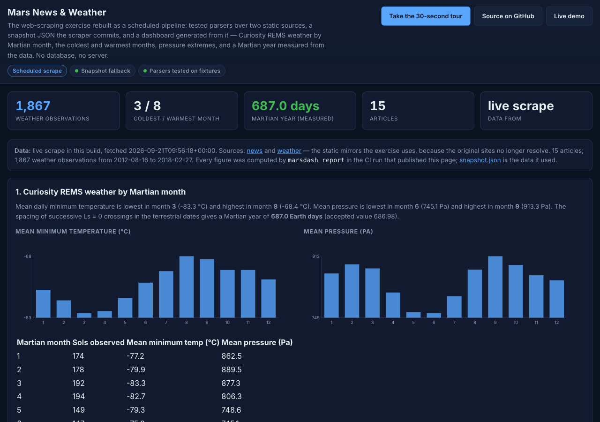
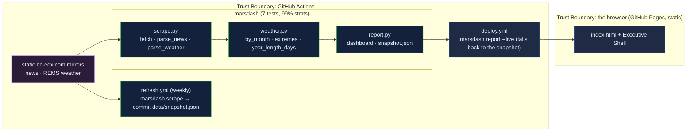

# WebScraping-Mars: the scraping exercise as a scheduled pipeline — tested parsers, a committed snapshot, a page that says where its numbers came from

[](https://github.com/Freddricklogan/WebScraping-Mars/actions/workflows/deploy.yml)
[](https://github.com/Freddricklogan/WebScraping-Mars/actions/workflows/refresh.yml)
[](#5-getting-started--verification)
[](https://github.com/Freddricklogan/WebScraping-Mars/actions/workflows/codeql.yml)
[](LICENSE)
[](https://freddricklogan.github.io/WebScraping-Mars/)

## 1. Executive Summary & Business Impact

**Problem statement.** The Mars scraping exercise drove a headless
browser at four websites, stored the result in MongoDB and served it
from Flask. All four sites are gone; the scraper fell through to
placeholder images without saying so; and nothing was ever deployed
(`AUDIT.md`).

**Solution & value delivered.** A small pipeline: `requests` and
BeautifulSoup parsers, tested on committed fixtures, over the two static
mirrors the exercise now uses; a weekly GitHub Action that refreshes
`data/snapshot.json` and commits it when it changes; and a CI build
that tries a live scrape, falls back to the committed snapshot, and
renders a dashboard that states which it used. The weather data is
analysed rather than displayed: mean minimum temperature and pressure
by Martian month, the extremes, and a Martian year measured from the
data at 687.0 Earth days (accepted: 686.98).

**[→ Read the full case study](docs/CASE_STUDY.md)**



## 2. Demonstrated Competencies & Technical Skills

- **Data Pipelines & Automation** — scheduled scrape with commit-if-
  changed, snapshot fallback with stated provenance, static publication.
- **Parsing Discipline** — pure parsers that fail loudly on structural
  change, fixture-based tests, schema checks on every row.
- **Analysis** — monthly aggregation, extremes, a physical constant
  recovered from the data.
- **Engineering Practice** — typed package with a CLI, 7 tests at 99 %
  statement coverage, ruff / mypy strict / bandit / pip-audit / Trivy.

## 3. System Architecture & Data Flow



## 4. Technical Highlights & Engineering Decisions

### ADR-1 — A snapshot in the repository, refreshed on a schedule

**Context.** Scraped data lived in a database nobody could reach, and
the page could not be built without it.

**Decision.** `marsdash scrape` writes `data/snapshot.json`; a weekly
workflow commits it when it changes; the build renders from a live
scrape when possible and otherwise from the snapshot, printing which.

**Consequence.** The dashboard always builds, is reproducible from the
commit, and never pretends a failed fetch succeeded.

### ADR-2 — Parsers that raise

**Context.** The old scraper substituted placeholders on failure.

**Decision.** `parse_news` and `parse_weather` check the header and
each row and raise `ValueError` with a reason; tests exercise five
distinct failures.

**Consequence.** A changed source page fails the refresh job visibly
instead of publishing an empty table.

### ADR-3 — Compute the answers the exercise asks for

**Context.** The weather table was shown, not analysed.

**Decision.** `weather.py` aggregates by Martian month and estimates
the year from Ls = 0 crossings, with a fallback estimator when fewer
than two crossings are present.

**Consequence.** Months 3 and 8 are coldest and warmest, 6 and 9 lowest
and highest pressure, and the year lands within a day of the accepted
value — all asserted by tests.

## 5. Getting Started & Verification

**Prerequisites.** Python 3.12 and `uv`.

```bash
git clone https://github.com/Freddricklogan/WebScraping-Mars.git
cd WebScraping-Mars
uv venv && uv pip install -e ".[dev]"
make check                                  # lint, typecheck, test, security, build (from the snapshot)
uv run marsdash scrape --out data/snapshot.json   # refresh the snapshot from the sources
uv run marsdash report --out dist --live    # live scrape with snapshot fallback
```

**Verification — the numbers this repository actually produced:**

| Check | Result |
| --- | --- |
| Tests (pytest) | **7 passed / 7** |
| Coverage | **99%** statements over `marsdash` (CLI excluded) |
| ruff, ruff format, mypy --strict | clean |
| bandit, pip-audit | 0 findings; no known vulnerabilities |
| Snapshot | 15 articles; 1,867 REMS observations from 2012-08-16 to 2018-02-27 (276 KB) |
| Weather | coldest month 3 (−83.3 °C), warmest 8; lowest pressure month 6, highest 9; Martian year 687.0 days (accepted 686.98) |
| Dashboard smoke (headless Chrome) | **0 console errors**; 24 bars, 15 news items, 1 table, 3 tour steps; no horizontal scroll at 1280 or 400 px |

## 6. Live Demo & Production Showcase

**<https://freddricklogan.github.io/WebScraping-Mars/>** — the
dashboard CI built, with `snapshot.json` beside it.

**30-second guided walkthrough.** Press **Take the 30-second tour**:
where the numbers came from, the weather answers, and the parsed news.
